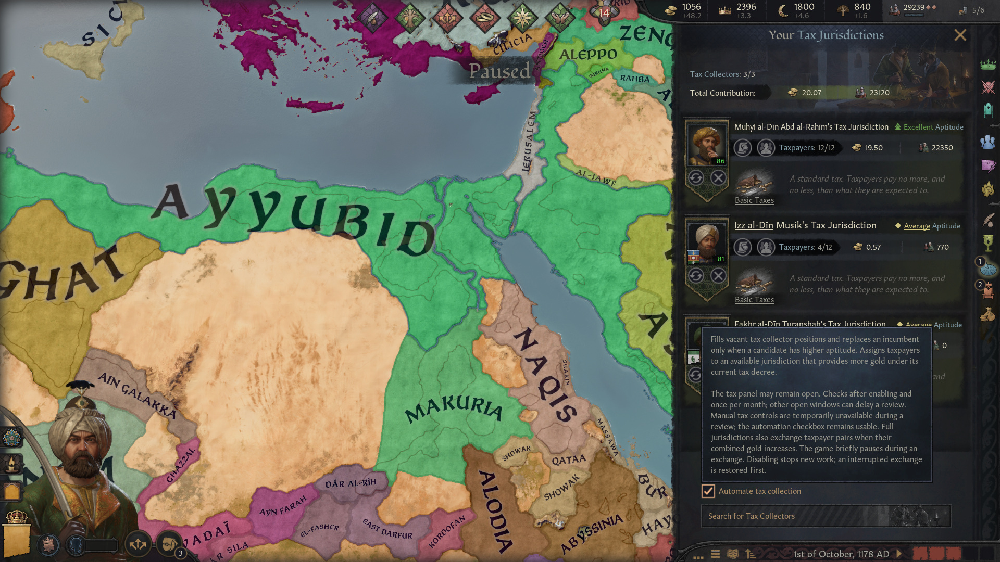

# Tax Collection Automation

## At a glance

- 🟢 **Version 0.1.1** · Targets CK3 **1.20.0.4**.
- 🟢 A standalone project for player-controlled clan rulers and their tax jurisdictions.
- 🟢 Maintains capable collectors and directs taxpayers toward better gold income.
- 🟢 **Languages:** English, French, German, Japanese, Korean, Polish, Russian, Simplified Chinese and Spanish.
- 🔴 Replaces five tax/dialog interface files; overlapping mods need a compatibility patch.
- 🔴 Uses individual moves and pair exchanges; some profitable wider rearrangements can be missed.

## Let the treasury manage the paperwork

Your ruler should not need to revisit every collector appointment whenever a better candidate arrives. One checkbox in the tax collection panel enables automated collector review and taxpayer allocation.

## Collector appointments and taxpayer allocation

The observer checks all available collector positions, uses CK3's own aptitude score and legal candidate list, and keeps incumbents when an alternative is only equally capable. A replacement must be a strict improvement. Normal appointment restrictions and dismissal consequences still apply.

Taxpayer allocation compares the game's actual gold contribution preview for legal jurisdictions. Final gold takes priority over raw collector aptitude: a permitted Jizya jurisdiction can win even with a less capable collector. The observer places unassigned taxpayers in legal vacancies, makes moves with better observed gold previews and exchanges pairs of taxpayers between full jurisdictions when their combined income increases. Direct-move previews are collected while game time may run; exchanges recheck both taxpayers' income in both jurisdictions while paused. Existing decrees, religious restrictions and capacity matter. The mod does not choose new tax decrees for the player.

The first review is requested when automation is enabled; later reviews are requested monthly. Disabling stops new reviews. If a pair exchange is only partly complete, its original assignments are restored first. Completed appointments and allocations remain in place.

CK3's separate **Automatically assign vassals to jurisdictions** checkbox controls the game's own assignments. This mod works with either setting: turning it off does not stop this mod from assigning taxpayers. Leaving it on keeps CK3's automatic assignment enabled between reviews and when this mod is off. During a pair exchange, the mod temporarily disables it and then restores your setting.

## Getting started

1. Add **Tax Collection Automation** to your launcher playset.
2. As a clan ruler, open the tax collection panel and enable the automation checkbox.
3. Keep the tax panel open or close it. Other open windows may defer a review.
4. Leave it enabled for monthly reviews, or uncheck it to stop new work.

An already-open tax panel stays open after a review. To change tax decrees, switch off **Automate tax collection**, wait for any exchange recovery and for the controls to become available, choose your decrees, then switch it on again. Manual controls, including decree selection, are locked during automated reviews. Pair exchanges briefly pause the game and restore the previous pause setting afterward.

## Compatibility and load order

The implementation targets the native clan tax system. It replaces `window_manage_tax_slots.gui`, `window_appoint_tax_collector.gui`, `window_tax_slot_assign_vassal.gui`, `window_tax_slot_vassals.gui` and `shared/dialogs.gui`. Another mod replacing those same windows requires a compatibility patch; changing load order does not merge them.

## Saves and known limits

The checkbox is saved for the current player character. A successor is not automatically opted in. Before removing the mod, disable automation and allow any pending exchange to finish recovery. Completed appointments and allocations are ordinary game state and remain in place.

The allocation algorithm uses direct improvements and profitable pair exchanges; it does not guarantee the global maximum when an improvement requires a larger cycle. Exchange support targets the eight vanilla decrees and single-player campaigns; the pair planner skips unknown custom decrees. At total capacity, the mod exchanges assigned taxpayers but does not evict one to admit an unassigned taxpayer. Unassigned taxpayers use vacancies already available to them. The mod does not plan a less profitable move for another taxpayer just to free a suitable place, even when that wider rearrangement could increase total income. Already assigned collectors and the ruler's diarch keep their jurisdictions: moving them can affect other taxpayers' income through collector aptitude.

If an original jurisdiction disappears or changes owner during recovery, the mod preserves the unfinished exchange. While that recovery remains accessible to the current ruler, the tax panel shows a warning; check the affected jurisdictions before enabling it again to retry. Recovery after succession or switching characters is not guaranteed. Large-realm performance and multiplayer behavior are not verified.

## Feedback and support

Include your CK3 version, mod list, collector aptitude, tax decrees and the affected taxpayer when reporting a problem.

- [Report an issue on GitHub](https://github.com/G4VV4KH/-CK3-Tax-Collection-Automation/issues)
- Email: g4vv4kh@gmail.com

### [Want to support my work? Donate on Ko-fi 💛](https://ko-fi.com/g4vv4kh)

## Find this mod elsewhere

- [Steam Workshop](https://steamcommunity.com/sharedfiles/filedetails/?id=3815381275)
- [Paradox Mods](https://mods.paradoxplaza.com/mods/162345/Any)
- [Nexus Mods](https://www.nexusmods.com/crusaderkings3/mods/410)
- [GitHub](https://github.com/G4VV4KH/-CK3-Tax-Collection-Automation)

## My other mods

- [Parley: The Negotiating Table](https://steamcommunity.com/sharedfiles/filedetails/?id=3811090081) — negotiate diplomatic agreements.
- [Marriage Calculation Assistant](https://steamcommunity.com/sharedfiles/filedetails/?id=3811100163) — compare and sort marriage candidates.
- [Your Own Hegemony](https://steamcommunity.com/sharedfiles/filedetails/?id=3811201582) — found a custom hegemony.
- [Vassalization Extended](https://steamcommunity.com/sharedfiles/filedetails/?id=3813943691) — choose Forced Vassalization terms without a county limit.
- [Court Automation](https://steamcommunity.com/sharedfiles/filedetails/?id=3814028714) — automate court positions and recruit courtiers or knights.
- [Nomad Autorefill](https://steamcommunity.com/sharedfiles/filedetails/?id=3814793283) — automatically reinforce nomadic Men-at-Arms using herd or gold.

These mods are optional.

## Credits

Cover artwork was generated with AI. The supplied tax-panel icon served as a visual reference. The interface adapts CK3's native GUI files. Mod code, text and translations are being developed with AI assistance.

## Gallery

Tax collection automation enabled in the native tax panel, with its English tooltip visible. Authentic in-game screenshot.

## Contributing

See [developer notes](dev.md) for implementation, validation and contribution guidance.
